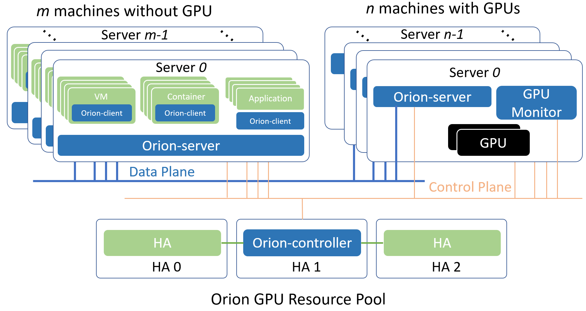

# 概述
Orion vGPU软件是一个为云或者数据中心内的AI应用，CUDA应用提供GPU资源池化，提供GPU虚拟化能力的系统软件。通过高效的通讯机制，使得AI应用，CUDA应用可以运行在云或者数据中心内任何一个物理机，Container或者VM内而无需挂载物理GPU。同时为这些应用程序提供在GPU资源池中的硬件算力。通过这种Orion GPU池化的能力，可以提供多个优点：
* 兼容已有的AI应用和CUDA应用，使其仍然具有使用GPU加速的性能
* 为AI应用和CUDA应用在云和数据中心的部署提供了很大的灵活度。无需受GPU服务器位置、资源数量的约束。
* Orion GPU资源随AI应用和CUDA应用启动时分配，随应用程序退出时自动释放。减少GPU空闲时间，提高共享GPU的周转率。
* 通过对GPU资源池的管理和优化，提高整个云和数据中心GPU的利用率和吞吐率。
* 通过统一管理GPU，减轻GPU的管理复杂度和成本。

# 支持列表

## 处理器
* x86_64

## 操作系统
* 64位 Ubuntu 18.04 LTS，16.04 LTS, 14.04 LTS
* 64位 CentOS 7.x

## NVIDIA GPU
* NVIDIA T4, RTX 2080 Series, RTX 6000, RTX 8000
* NVIDIA V100
* NVIDIA P100, P40, P4, GTX 1080 Series, GTX 1060 Series
* Nvidia K80，Nvidia K40

## NVIDIA CUDA
* CUDA 10.1
* CUDA 10.0
* CUDA 9.2
* CUDA 9.1
* CUDA 9.0
* CUDNN 7.4.2 及以上

## 深度学习框架
* TensorFlow 2.0, TensorFlow 1.8 - 1.14
* Pytorch 1.0 - 1.3
* PaddlePaddle 1.5.2
* NVCaffe

## 网络
* RoCE v2, Infiniband
* TCP以太网络

## 容器环境
* Docker 1.13 及以后版本

## 虚拟化环境
* QEMU-KVM (QEMU 2.x)

## 容器框架
* Kubernetes 1.10 及以后版本

# 已知问题
下面列出当前版本不支持的CUDA库、工具以及使用模式
* 不支持CUDA应用程序使用 Unified Memory
* 不支持 nvidia-smi 工具
* 不支持OpenGL相关接口，不支持图形渲染相关接口
* 有限支持CUDA IPC，对部分程序可能不支持。
* 部分应用需要从源码重新编译以保证动态链接 CUDA 库。

# 必要组件介绍

## Orion Controller
该组件为一个长运行的服务程序，其负责整个GPU资源池的资源管理。其响应Orion Client的vGPU请求，并从GPU资源池中为Orion Client端的CUDA应用程序分配并返回Orion vGPU资源。  
该组件可以部署在数据中心任何网络可到达的系统当中。每个资源池部署一个该组件。资源池的大小取决于IT管理的需求，可以是整个数据中心的所有GPU作为一个资源池，也可以每个GPU服务器作为一个独立的资源池。

## Orion Server
该组件为一个长运行的系统服务，其负责GPU资源化的后端服务程序。Orion Server部署在每一个CPU以及GPU节点上，接管本机内的所有物理GPU。通过和Orion Controller的交互把本机的GPU加入到由Orion Controller管理维护的GPU资源池当中。  
当Orion Client端应用程序运行时，通过Orion Controller的资源调度，建立和Orion Server的连接。Orion Server为其应用程序的所有CUDA调用提供一个隔离的运行环境以及真实GPU硬件算力。

## Orion Client
该组件为一个运行环境，其模拟了NVidia CUDA的运行库环境，为CUDA程序提供了API接口兼容的全新实现。通过和Orion其他功能组件的配合，为CUDA应用程序虚拟化了一定数量的虚拟GPU（Orion vGPU）。  
使用CUDA动态链接库的CUDA应用程序可以通过操作系统环境设置，使得一个CUDA应用程序在运行时由操作系统负责链接到Orion Client提供的动态链接库上。由于Orion Client模拟了NVidia CUDA运行环境，因此CUDA应用程序可以透明无修改地直接运行在Orion vGPU之上。

# 典型部署架构
以下介绍两种常见的Orion GPU资源池化部署方案。一种是All-in-One的本地GPU虚拟化方案，一种是部署到分布式多台物理机的GPU资源池化方案。

## Orion GPU资源池化方案


分布式GPU资源池化方案指的是把一台或者多台服务器内的GPU作为资源池，通过Orion向局域网内任一个物理机、Container或者VM内的CUDA应用程序提供虚拟化GPU的部署方式。  
选择局域网内至少一个Linux服务器部署Orion Controller。该Controller必须可以被属于同一个资源池的其他Orion组件通过网络访问。  
每一个服务器上部署Orion Server服务，Oiron Server自动适配该服务器是否安装有GPU，从而开启不同的功能。
在每一个需要运行CUDA应用程序的物理机、Container和VM里部署Orion Client运行库。
各个Oiron组件通过Orion Controller的控制功能完成服务发现，资源调度等功能。   
从逻辑上，以上各个Orion组件使用了control plane和data plane两套网络。其中control plane用于和Orion Controller组件的通讯。该部分通讯流量不大，对网络延迟和带宽需求不高。data plane用于Orion Client和Orion Server之间执行CUDA任务之间的通讯。该部分对于网络的延迟和带宽有一定需求。建议使用支持RDMA的网络。在实际环境中，control plane和data plane可以是同一个物理网络。

# 安装部署

以下安装部署的步骤，说明，均以Orion软件包存放路径在 /root/orion 为例进行说明

## GPU Monitor

该组件为可选组件，用于监控物理GPU的利用率。如果生产环境中已有其他替代的功能，该组件可以不用部署。

### 环境依赖
* Docker容器环境
* 与Docker版本匹配的Nvidia Docker runtime
* Nvidia GPU驱动

执行如下命令导入容器镜像，并运行服务
```
cd /root/orion/gpu-monitor
gunzip dcgm-exporter.tar.gz | docker load
gunzip node-exporter.tar.gz | docker load
./run-nvidia-exportor.sh
```

## Orion Controller

Orion Controller包括物理GPU管理，vGPU资源分配，GUI监控，管理功能。在典型使用场景下，在一个分布式环境，仅需要部署一个实例。以下通过容器化部署Orion Controller。

### 环境依赖
* Docker容器环境

### 启动Orion Controller服务

执行如下命令导入容器镜像，并运行服务
```
cd /root/orion/controller
gunzip orion-controller-ent-2.2.tar.gz | docker load
gunzip prometheus.tar.gz | docker load
```
编辑配置文件 /root/orion/controller/prometheus.yml
修改static_configs中的targets 列表，该列表是安装了GPU Monitor服务的GPU服务器的列表。当GPU Monitor有多个IP网段地址的时候，该地址应该与 第3章节部署Orion Server时绑定的数据网段相同，例如文档中的“ORION_BIND_ADDR=CCCC”地址，或者是Orion Server的配置文件中的bind_addr相同。  
执行如下命令运行Orion Controller服务：
```
cd /root/orion/controller
./run-controller.sh
```
服务成功启动后，根据屏幕输出提示，在本宿主机的所有网段提供如下服务：
* 调度服务：部署Orion Server时需要配置该地址
* Web GUI服务：通过浏览器访问该服务进行监控和管理

### Orion Controller的日志文件
Orion Controller的日志文件存放在Orion Controller 容器内的 /root/controller.log 中

## Orion Server

Orion Server为GPU资源池化提供底层的虚拟GPU服务。在所有的CPU节点、GPU节点均需部署该服务。  
Orion Server支持的虚拟化/容器平台有：
* Docker ：>= 1.13
* Libvirt + QEMU-KVM : QEMU > 2.0.0

CUDA业务运行KVM虚拟的场景，在把Orion Server部署至宿主机时，由于宿主机可能存在SELinux，apparmor的限制，安装Orion Server之后的配置，仅对安装之后新创建的虚拟机，或者是从Power OFF状态重新启动的虚拟机生效。

### 环境依赖

对于无物理GPU的CPU节点
* g++ 4.8.5 或以上版本
* Linux基本库依赖libcurl3, libibverbs1, numactl-libs（libnuma）, libvirt-devel
* 如果使用Mellanox RDMA网络，需要安装RDMA驱动，以及Mellanox的OFED

GPU节点额外的环境需求
* 安装有Nvidia 物理GPU 驱动
* NVIDIA CUDA SDK 9.0, 9.1, 9.2, 10.0, 10.1
* NVIDIA CUDNN 7.4.2 以上版本，推荐 7.6.x
* NVIDIA NCCL 和最高CUDA SDK版本匹配

在CPU、GPU服务器宿主机执行如下命令安装Orion Server
```
cd /root/orion/server
sudo ./install-server.sh
```

### 配置Orion Server
通过配置文件 /etc/orion/server.conf 可以对Orion Server进行必要的配置，其中支持的配置选项有：
```
[log]
    log_with_time = true    ; 记录日志的时候是否添加时间戳
    log_to_screen = true    ; 日志是否输出到屏幕的标准输出
    log_to_file = true      ; 是否记录日志至磁盘文件中
    log_level = INFO        ; 日志级别，支持 INFO， DEBUG
    file_log_level = INFO   ; 日志输出到文件中的日志级别

[controller]
    controller_addr = 127.0.0.1:9123    ; Orion Controller的调度器IP地址和端口

[server]
    vgpu_count = 4          ; 默认一个物理GPU被拆分成多少个vGPU
    bind_addr = 127.0.0.1   ; data plane的IP地址
    ;bind_net =             ; data plane的网络名字，例如eth0, eth1。bind_addr 和 bind_net 仅能配置1个
    listen_port = 9960      ; Orion Server的服务端口
    enable_kvm = true       ; 是否支持Orion Client运行在KVM的VM中
    enable_shm = true       ; 是否使用共享内存加速通讯
    enable_rdma = true      ; 是否使用RDMA加速通讯
    ibverbs_device = mlx5_0 ; 如果使用RDMA，硬件设备名。仅在Orion Server无法推断硬件时需要配置

[server-nccl]
    comm_id = 127.0.0.1:9970; nvidia NCCL通讯的网络和端口

[throttle]
    throttle_level = 100                ; 算力控制的隔离程度，取值范围[0, 100]。数字越少隔离越好
    enable_computation_throttle = true  ; 是否启动算力控制
    computation_throttle_mode2 = true   ; 算力控制的模式，仅支持true
```

### Orion Server任务控制
通过如下命令可以启动Orion Server
```
sudo systemctl start oriond
```
通过如下命令可以执行其他Orion Server操作
```
sudo systemctl stop oriond      ## 停止Orion Server服务
sudo systemctl restart oriond   ## 重启Orion Server服务
sudo systemctl status oriond    ## 查看Orion Server服务状态
sudo systemctl enable oriond    ## 添加Orion Server服务到开机启动服务
sudo journalctl -u oriond       ## 查看Orion Server的服务日志
```

### Orion Server的日志文件
Orion Server的日志存在两个位置
* /var/log/orion/server.log 该文件记录了所有Orion Client的握手过程
* /var/log/orion/session   该目录以单个文件的形式，记录了每次业务运行时的日志。每运行一个Orion Client应用，该目录产生一个独立的日志文件。如果在握手过程中失败，则不产生日志文件。

### 多版本 CUDA SDK 共存

Orion Server 可以同时支持多个CUDA版本，使得依赖不同CUDA版本的上层应用可以同时使用Orion vGPU。为了支持多个CUDA SDK版本，Orion Server 要求 CUDA 安装在宿主机默认路径（即 `/usr/local/cuda-x.y`）下面。例如为了支持 CUDA 10.0 和 CUDA 9.0，`/usr/local` 目录下应该有 `cuda-9.0` 和 `cuda-10.0` 这两个目录。

此外，多 CUDA 版本共存时，不需要设置 `CUDA_HOME`，`LD_LIBRARY_PATH` 等环境变量，也不依赖于部分用户环境中存在的软链接 `/usr/local/cuda => /usr/local/cuda-x.y`，这是因为 Orion Server 可以根据 Orion Client 环境中实际安装的 Runtime 对应于 CUDA 的版本号，动态选择合适的 CUDA SDK 版本。

## 查看Orion 服务状态
在同一个局域网内，通过浏览器（推荐chrome）访问Orion Controller所在环境的局域网地址： http://IP:Port   
其中IP为Orion Controller所在环境的局域网地址，Port为部署Orion Controller时提示的Web GUI的服务端口。通过默认用户名（密码 ）登录进入系统 :  admin(admin)   
在侧边栏里看到Orion Controller的IP地址，点击展开之后有如下的内容：
* 摘要：显示Orion Controller所管理的整个Orion vGPU资源池的资源数量，节点状态等
* 任务：显示正在运行且使用了Orion vGPU资源的任务，以及每个任务使用的vGPU资源的分布情况
* Orion GPU节点列表：通过点击展开可以看到一组GPU节点的状态，并且在每个节点的工作面板上看到物理GPU的划分使用情况


## 部署 Orion Client

### 环境依赖
* g++ 4.8.5 或以上版本，libcurl，openssl，libuuid, libibverbs1

### 软件安装

在CUDA应用环境执行如下的安装命令
```
cd /root/orion/client
sudo ./install-client-x.y
```
上述命令的x，y为根据所需 CUDA 版本选择对应的 installer，例如`install-client-10.0` 对应于 CUDA 10.0   
上述命令把 Orion Client 环境安装至默认路径 `/usr/lib/orion` 中，并通过 `ldconfig` 机制将 `/usr/lib/orion` 添加到系统动态库搜索路径。   
注意：如果Orion Client按照到和GPU同样的宿主机环境，由于Orion Client安装的 /usr/lib/orion 和物理GPU的 CUDA SDK可能存在版本冲突。对于同样的动态库在两个不同磁盘位置的加载顺序，应该由安装人员自己维护解决。


### 配置Orion Client

Orion Client可以通过三类方法配置运行参数

* 通过环境变量配置运行参数
* 通过当前用户home目录中 {$HOME}/.orion/client.conf 配置文件配置运行参数
* 通过 /etc/orion/client.conf 配置文件配置运行参数

**上述方法中，通过环境变量配置的优先级最高，系统 `/etc/orion` 目录中配置文件的优先级最低**

Orion Client的配置中分为静态配置部分和动态配置部分。
* 静态配置部分指的是在目标环境中每次运行CUDA应用程序都保持不变的部分。
* 动态配置部分指的是根据CUDA应用程序使用的Orion vGPU资源不同而不同的配置。

配置文件的格式为：
```
[log]
    log_with_time = true    ; 记录日志的时候是否添加时间戳
    log_to_screen = true    ; 日志是否输出到屏幕的标准输出
    log_to_file = true      ; 是否记录日志至磁盘文件中
    log_level = INFO        ; 日志级别，支持 INFO， DEBUG
    file_log_level = INFO   ; 日志输出到文件中的日志级别

[controller]
    controller_addr = 127.0.0.1:9123    ; Orion Controller的调度器IP地址和端口

[client]
    enable_net = false      ; 是否使用TCP网络和Orion Server通讯
```
其中环境变量 ORION_CONTROLLER 设置 Orion Controller 的地址具有比配置文件更高的优先级   
例如在当前SHELL通过 export ORION_CONTROLLER 环境变量可以忽略配置文件中的controller_addr配置

动态配置包括：
* 环境变量 ORION_VGPU 设置当前环境下 CUDA 应用程序申请使用多少个 Orion vGPU
    * 例如通过 export ORION_VGPU=2 指定了当前 CUDA 应用程序申请使用 2 个Orion vGPU
    * 该配置无默认值
* 环境变量 ORION_GMEM 设置当前环境下，CUDA 应用程序申请使用的每个 Orion vGPU 中的显存大小。以MiB为单位。
    * 例如通过 export ORION_GMEM=4096 为当前 CUDA 应用程序指定了每个 Orion vGPU的显存大小为 4096 MiB。
    * 该配置的默认值取决于默认一个物理GPU被切分为几个vGPU
* 环境变量 ORION_RATIO 设置当前环境下，CUDA 应用程序申请使用的每个 Orion vGPU 占用一个物理GPU算力的百分比。以%为单位
    * 例如通过 export ORION_RATIO=50 为当前 CUDA 应用程序指定了每个 Orion vGPU的50%的算力。
    * 该配置的默认值取决于默认一个物理GPU被切分为几个vGPU
* 环境变量 ORION_CROSS_NODE 为可选参数，参数为1且申请多个vGPU时，允许Orion Controller跨越多个物理GPU节点调度资源，使得分配的多个vGPU可能来自于不同的物理GPU节点。
    * 该参数为1时，ORION_RATIO必须为100
    * 该配置默认为0

### Orion Client日志
Orion Client日志位于执行应用程序的用户home目录中的 `${HOME}/.orion/log` 目录中。每次CUDA应用运行均会在该目录产生一个对应于该次任务的日志文件。


# 使用Orion vGPU
本章节介绍在Orion Client环境中，如何为CUDA应用程序配置使用Orion vGPU

## Orion vGPU资源
通过安装部署Orion vGPU软件，所有Orion Server所在的GPU服务器内的GPU均加入了一个全局共享的资源池。每个物理GPU均被划分为多个逻辑vGPU。划分vGPU的默认粒度为启动 Orion Server 时，配置文件 `/etc/orion/server.conf` 中的 `vgpu_count` 参数指定。若设置 `vgpu_count=n`，则每个vGPU默认的显存大小为物理GPU显存的 n 分之一。

## Orion vGPU的使用
由于Orion vGPU的调用接口兼容物理GPU的调用接口，因此CUDA应用程序可以无感知无修改地像使用物理GPU那样使用Orion vGPU。仅需要在运行CUDA应用程序时，通过配置文件、环境变量为本CUDA应用程序配置运行环境即可。   

经过Orion GPU资源池化之后，资源池中的vGPU使用模式为CUDA应用程序即时申请即时使用的模式。也即是当CUDA应用程序调用CUDA接口初始化时才向Orion GPU资源池申请一定数量的vGPU，当CUDA应用程序退出时其申请到的vGPU自动释放至资源池中。多次调用CUDA应用程序分配到的vGPU不一定对应于同样的物理GPU资源。 

当Orion Client的静态环境配置完毕后，在运行一个CUDA应用之前，至少需要用 ORION_VGPU 环境变量指明该CUDA应用程序希望获得的vGPU数目。例如一个deviceQuery CUDA程序，如下的命令使得当该CUDA程序做设备发现时，通过CUDA的接口查询到2个GPU，每个GPU的显存是4096MiB。
```
export ORION_VGPU=2
export ORION_GMEM=4096
./deviceQuery
```
当上述deviceQuery CUDA程序启动时，会从Orion GPU资源池中独占两个vGPU。该程序结束时，会自动释放两个vGPU。可以通过重新设定环境变量，在运行CUDA应用程序之前改变对vGPU资源的使用。**一次CUDA应用程序所申请的多个vGPU可能存在于多个物理GPU上。**

**vGPU的使用对象为CUDA应用程序，而非物理机、Container或者VM虚拟机。即使在同一个环境下运行的多个CUDA应用程序，每一个应用程序都按照当前的运行环境向Orion GPU资源池申请独立的vGPU资源。如果并行运行多个CUDA应用程序，则消耗的vGPU数量为应用程序数目乘以 ORION_VGPU 所指定的vGPU数目。**

# 常见问题

用户首先需要确认Orion Server和Orion Client版本的匹配。不同版本之间的Orion Server和Orion Client无法共同使用。

* Orion Client端应用程序启动报告无法找到NVidia GPU
    * 此故障为应用程序没有使用Orion Client运行库导致，可能的原因有几种：
        * 该应用程序在编译期间静态链接了NVidia的库，导致其运行时并不调用Orion Client的运行库。该问题应该通过设置动态链接并重新编译解决。
        * 该应用程序虽然使用CUDA相关的动态链接库，但是编译器使用rpath选项指明了CUDA库加载的绝对路径，而该路径并非是Orion Client的安装路径。rpath优先级高导致库加载的路径非期望的Orion Client安装路径。该问题或者通过去掉rpath设置后重新编译解决，或者用Orion Client运行库覆盖rpath指明的路径内的库解决。
        * Orion Client库的安装路径没有使用ldconfig或者环境变量LD_LIBRARY_PATH放到动态库加载路径。该问题通过使用ldconfig永久把Orion Client的安装路径加入到系统搜索路径，或者正确使用环境变量LD_LIBRARY_PATH来设置。

* Orion Server服务无法启动，oriond进程启动失败
    * 通过运行 orion-check runtime server 来检查环境。可能的原因有
    * oriond进程依赖CUDA，CUDNN库无法搜索到导致可执行文件无法被操作系统启动。
        * 修改上述Orion Server服务配置文件
    * oriond进程依赖的其他库没有安装，例如libcurl，libopenssl等
